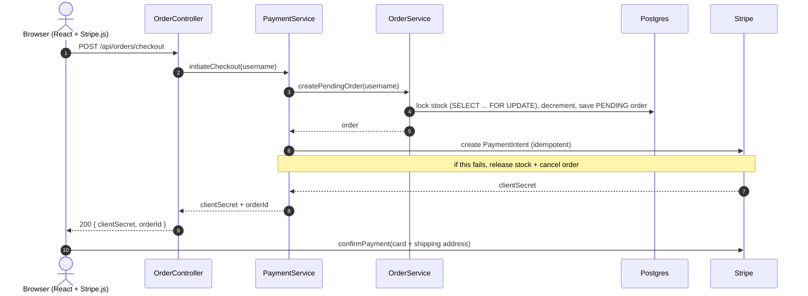
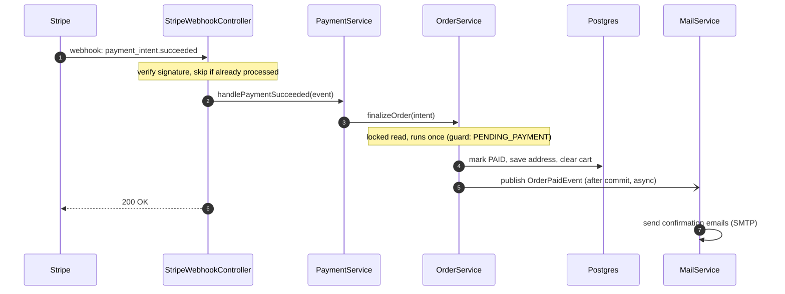
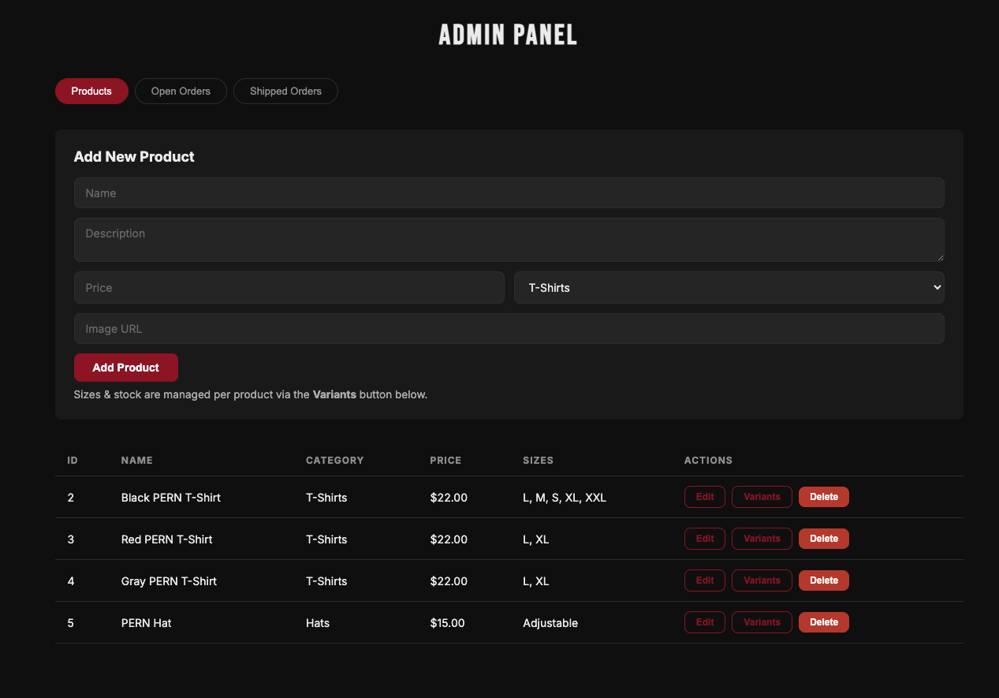

# PERN Merch 🎸

An e-commerce site for my band PERN, not the tech stack (sorry to disappoint). This is where fans can browse and buy official merch, and where I manage orders and inventory behind the scenes.

Check out the live site: [pernmerch.com](https://pernmerch.com/)

A full-stack storefront with real Stripe payments, inventory management, and an admin dashboard. The backend is where most of the engineering lives: it's built around the hard parts of a payment system, like idempotency, concurrency, and consistency between a local database and an external payment provider.

---

## Tech Stack

**Backend** — Java 21, Spring Boot 4, Spring Security (JWT), Spring Data JPA / Hibernate, PostgreSQL, Stripe Java SDK, Spring Mail

**Frontend** — React 19, Vite, React Router 7, Stripe Elements

**Infrastructure** — Docker, AWS Lightsail (backend container) + CloudFront/S3 (frontend), Neon Postgres

## Architecture


The Spring Boot service is a stateless REST API (no server-side sessions — auth is carried entirely in JWTs), which lets it scale horizontally and run comfortably in a 512 MB container.

---

## Backend Engineering Highlights

### Payment processing & reliability
Stripe checkout is built to handle the ways payments fail, not just the success case:

- **Webhook signature verification** — every Stripe event is verified against the signing secret before it's trusted ([StripeWebhookController.java](backend/src/main/java/com/ajcarpinello/Pern_Merch_Website/controller/StripeWebhookController.java)).
- **Idempotency at three layers** so a payment is never double-counted, even though Stripe retries webhooks until it gets a 2xx:
  1. **Stripe idempotency keys** on PaymentIntent creation, so a retried checkout returns the same intent instead of charging twice ([StripeService.java](backend/src/main/java/com/ajcarpinello/Pern_Merch_Website/service/StripeService.java)).
  2. A **processed-event dedup table** — every handled `event.id` is recorded, and repeat deliveries short-circuit ([PaymentService.java](backend/src/main/java/com/ajcarpinello/Pern_Merch_Website/service/PaymentService.java)).
  3. **Locked read + status guard** — `finalizeOrder` opens with a pessimistic row lock (`SELECT ... FOR UPDATE`), then bails unless the order is still `PENDING_PAYMENT`. So when the success webhook, the sweeper, and the cancel button race, they serialize on the row: the first finalizes, the rest block, then see `PAID` and bail — finalized (and emailed) exactly once. The lock is doing the work here; the guard alone wouldn't stop a double-finalize ([OrderRepository.java](backend/src/main/java/com/ajcarpinello/Pern_Merch_Website/repository/OrderRepository.java)).
- **Saga / compensating transactions** — if creating the Stripe intent fails after stock has already been reserved, the reservation is rolled back (stock released, order cancelled) so inventory never silently leaks ([PaymentService.java](backend/src/main/java/com/ajcarpinello/Pern_Merch_Website/service/PaymentService.java)).
- **Stripe-first cancellation** — cancelling an order cancels the PaymentIntent *before* releasing stock; if Stripe reports the payment actually succeeded in that window, the order is finalized instead of wrongly cancelled.
- **API-version-tolerant deserialization** — webhook payloads are deserialized the safe way first, falling back (with a warning) when the account's Stripe API version drifts from the library's.

The flow splits into two phases: checkout is synchronous (the browser drives it), while payment confirmation arrives asynchronously through a Stripe webhook, decoupled from the original request.

**Phase 1 — Initiate checkout (synchronous)**



**Phase 2 — Payment confirmation via webhook (asynchronous)**



### Concurrency & inventory integrity
The classic e-commerce race — two people buying the last shirt — is handled with **pessimistic row locks** (`SELECT ... FOR UPDATE`) on the product variant during checkout, so two concurrent transactions can't both pass the stock check and oversell ([ProductVariantRepository.java](backend/src/main/java/com/ajcarpinello/Pern_Merch_Website/repository/ProductVariantRepository.java)). The same locking strategy guards order finalization ([OrderRepository.java](backend/src/main/java/com/ajcarpinello/Pern_Merch_Website/repository/OrderRepository.java)) so concurrent code paths serialize instead of double-finalizing.

### Transaction-boundary discipline
Network calls and database transactions are deliberately kept separate. The checkout flow is split into short transactions around the Stripe network call so a DB transaction is never held open waiting on an external API — a common source of connection-pool exhaustion. This is called out explicitly in the code rather than left implicit ([PaymentService.java](backend/src/main/java/com/ajcarpinello/Pern_Merch_Website/service/PaymentService.java), [OrderService.java](backend/src/main/java/com/ajcarpinello/Pern_Merch_Website/service/OrderService.java)).

### Asynchronous, transaction-aware email
Order confirmation and merchant-notification emails fire from a `@TransactionalEventListener(AFTER_COMMIT)` running `@Async`, so:
- emails only send **after** the order actually commits (no "your order is confirmed" for a transaction that rolled back),
- the webhook thread returns immediately instead of blocking on SMTP,
- the email payload is **snapshotted while the JPA session is open**, avoiding lazy-loading exceptions after the transaction closes ([MailService.java](backend/src/main/java/com/ajcarpinello/Pern_Merch_Website/service/MailService.java), [OrderService.java](backend/src/main/java/com/ajcarpinello/Pern_Merch_Website/service/OrderService.java)).

### Scheduled background reclamation
Stripe never auto-cancels a standalone PaymentIntent, and there's no "customer walked away" webhook — so abandoned checkouts would silently hold inventory forever. A `@Scheduled` sweeper reclaims stock and cancels the intent for orders left pending past a configurable TTL, with per-order error isolation so one bad order doesn't abort the batch ([AbandonedOrderSweeper.java](backend/src/main/java/com/ajcarpinello/Pern_Merch_Website/service/AbandonedOrderSweeper.java)).

### Authentication & authorization
Stateless JWT auth implemented from the primitives: a custom `OncePerRequestFilter` validates the bearer token and populates the security context, BCrypt-hashed passwords, and role-based access control (`USER` / `ADMIN`) enforced at the route level ([SecurityConfig.java](backend/src/main/java/com/ajcarpinello/Pern_Merch_Website/config/SecurityConfig.java), [JwtAuthFilter.java](backend/src/main/java/com/ajcarpinello/Pern_Merch_Website/config/JwtAuthFilter.java), [JwtUtil.java](backend/src/main/java/com/ajcarpinello/Pern_Merch_Website/config/JwtUtil.java)).

### Data modeling
- **Product / ProductVariant** split so stock is tracked per size, with a unique constraint on `(product, size)` to prevent duplicate variants.
- **Soft deletes** on products: "deleting" flips an `active` flag instead of removing the row, so historical `order_items` keep valid foreign keys and order history is never corrupted ([Product.java](backend/src/main/java/com/ajcarpinello/Pern_Merch_Website/entity/Product.java)).
- **`BigDecimal`** for all money (no floating-point rounding), an **embedded `Address`** value object reused on both users and orders, and an **`OrderStatus` enum** acting as an order state machine (`PENDING_PAYMENT → PAID → CONFIRMED → SHIPPED`, or `CANCELLED`).
- **Price-at-purchase** is snapshotted onto each order item so later price changes don't rewrite order history.

### API design & error handling
A `@RestControllerAdvice` translates exceptions into consistent JSON error bodies, maps a custom `AppException` to the right HTTP status, and deliberately **does not leak internal exception details** on unexpected 500s ([GlobalExceptionHandler.java](backend/src/main/java/com/ajcarpinello/Pern_Merch_Website/controller/GlobalExceptionHandler.java)). Admin order history is **paginated** via Spring Data `PagedModel`. A DTO layer keeps JPA entities out of the API contract.

---

## Admin Dashboard

A role-gated panel at `/admin` for running the store — managing the catalog and pushing orders through fulfillment. Access is enforced in **two independent places**: the React route is wrapped in an admin-only guard, *and* every admin endpoint separately requires the `ADMIN` role server-side — so the UI guard is just convenience, not the security boundary ([ProtectedRoute.jsx](frontend/src/components/ProtectedRoute.jsx), [SecurityConfig.java](backend/src/main/java/com/ajcarpinello/Pern_Merch_Website/config/SecurityConfig.java)). It's split into three tabs ([Admin.jsx](frontend/src/pages/Admin.jsx)):



- **Products** — full catalog CRUD plus per-product variant (size/stock) management ([AdminProducts.jsx](frontend/src/pages/AdminProducts.jsx)). Stock is edited inline per size, and the variant layer enforces integrity: duplicate sizes are rejected (409), and a variant can't be deleted while it's referenced by an existing order or sitting in a customer's cart. Deleting a product is a soft delete that also clears it from any carts, so historical orders keep valid references.

- **Open Orders** — the fulfillment work queue: every `PAID` and `CONFIRMED` order, oldest-first, so orders are worked FIFO ([AdminOrders.jsx](frontend/src/pages/AdminOrders.jsx)). Each one advances along a fixed ladder — `PAID → CONFIRMED → SHIPPED` — surfaced as a single next-step button; once shipped it drops off the queue. The backend only honors those two forward transitions and rejects anything else, so order status can't be set arbitrarily from the client. Rows expand to show line items (with price-at-purchase) and the shipping address.

- **Shipped Orders** — a read-only, newest-first history of shipped orders, paginated server-side (20 per page via Spring Data `PagedModel`), with the same expandable detail view.

---

## API Surface

| Method | Endpoint | Access | Purpose |
|---|---|---|---|
| `POST` | `/api/auth/register` · `/login` | Public | Register / obtain JWT |
| `GET` | `/api/products` · `/api/products/{id}` | Public | Browse catalog |
| `POST/PUT/DELETE` | `/api/products/**` · `/api/products/variants/**` | Admin | Manage catalog & stock |
| `GET/POST/PUT/DELETE` | `/api/cart/**` | User | Cart operations |
| `POST` | `/api/orders/checkout` | User | Create order + Stripe PaymentIntent |
| `POST` | `/api/orders/cancel` | User | Cancel pending checkout (Stripe-first) |
| `GET` | `/api/orders` | User | Order history |
| `GET/PUT` | `/api/orders/workingOrders` · `/updateStatus/**` · `/shippedOrders/**` | Admin | Fulfillment dashboard |
| `POST` | `/api/webhooks/stripe` | Stripe | Signed payment lifecycle events |

---

## Running Locally

**Prerequisites:** Java 21, Node 18+, Docker (for Postgres), a Stripe test account.

### Backend
Create `backend/.env`:

```properties
POSTGRES_URL=jdbc:postgresql://localhost:5434/pern-merch
POSTGRES_USERNAME=postgres
POSTGRES_PASSWORD=postgres
JWT_SECRET=<base64-encoded 32+ byte secret>
ADMIN_USERNAME=admin
ADMIN_PASSWORD=<choose one>
STRIPE_SECRET_KEY=sk_test_...
STRIPE_WEBHOOK_SECRET=whsec_...
CORS_ALLOWED_ORIGINS=http://localhost:5173
# Optional — leave unset to disable email locally
# SPRING_MAIL_HOST=...
```

```bash
docker compose up -d postgres          # Postgres on :5434
cd backend && ./mvnw spring-boot:run   # API on :8080
stripe listen --forward-to localhost:8080/api/webhooks/stripe   # local webhook delivery
```

An admin account is seeded automatically from `ADMIN_USERNAME` / `ADMIN_PASSWORD` on first run.

### Frontend
Create `frontend/.env`:

```properties
VITE_API_BASE_URL=http://localhost:8080/api
VITE_STRIPE_PUBLISHABLE_KEY=pk_test_...
```

```bash
cd frontend && npm install && npm run dev   # SPA on :5173
```

---

## Project Layout

```
backend/   Spring Boot API
  └─ src/main/java/.../Pern_Merch_Website/
       config/      Security, JWT filter, CORS, admin seeder
       controller/  REST endpoints + global exception handler
       service/     Business logic (orders, payments, cart, mail, sweeper)
       repository/  Spring Data JPA + custom locking queries
       entity/      JPA entities & enums
       dto/         API request/response models
       event/       Domain events (OrderPaidEvent)
frontend/  React + Vite SPA (pages, components, context, api client)
```
